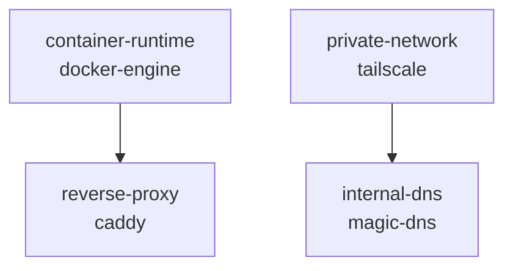

# Diseño del Runtime (v1.0)

Este documento define la base operativa del **Homelab Runtime**, actuando como el diseño técnico (`Sprint-2-Runtime-Design.md`). Su propósito no es reescribir ni rejustificar las decisiones del [ADR-010](../../adr/ADR-010-homelab-runtime.md), sino interpretarlas para convertirlas en un modelo estrictamente ejecutable.

## Capítulo 1: Modelo Conceptual

### 1. Definición y Entidades Fundamentales

El Runtime es un motor de convergencia responsable de llevar el sistema desde un *Current State* observado hacia un *Desired State* declarado, mediante la ejecución coordinada de componentes. **El Runtime no conoce la implementación de ninguna capacidad; únicamente coordina componentes mediante contratos.**

El modelo operativo se fundamenta en las siguientes entidades abstractas:

- **Capacidad:** Una función o servicio lógico que el sistema provee (ej. Reverse Proxy).
- **Componente:** Unidad mínima de ejecución del Runtime que implementa una capacidad mediante el contrato definido por ADR-010.
- **Registro:** Declara los componentes registrados y las relaciones de dependencia entre ellos.
- **Operación:** Acciones atómicas y estandarizadas provistas por el contrato de los componentes (`install`, `configure`, `validate`, `repair`).
- **Estado:** La condición actual de una capacidad observada empíricamente.
- **Plan:** Representación efímera de las operaciones necesarias para converger del *Current State* al *Desired State*.

### 2. Axiomas del Motor

#### Axioma 1: Razonamiento sobre Estados, no sobre Acciones
El motor nunca recibe instrucciones imperativas de despliegue. Su lógica determina qué operaciones ejecutar cruzando dos variables:
- **Desired State:** El estado objetivo que deben alcanzar las capacidades seleccionadas.
- **Current State:** La realidad empírica del servidor observada en el momento preciso de la ejecución.

#### Axioma 2: Las Dependencias Forman un DAG
El sistema modela sus dependencias como un **Grafo Acíclico Dirigido (DAG)**, donde los nodos son componentes que representan capacidades, y las aristas son sus requisitos. El motor procesa este grafo topológicamente: ningún componente puede ejecutar operaciones hasta que todas las capacidades de las que depende hayan alcanzado su estado objetivo.

#### Axioma 3: Idempotencia y Convergencia Continua
Dado que el estado real puede degradarse entre ejecuciones, el motor opera garantizando la convergencia continua: 
1. Observa el estado actual del grafo.
2. Calcula la brecha (delta) contra el *Desired State*.
3. Genera un plan de transición.
4. Aplica las operaciones necesarias para cerrar la brecha.
Si no existe brecha, el plan estará vacío y el sistema permanecerá inalterado.

### 3. Separación de Responsabilidades (El "Motor Puro")

El Runtime es estrictamente agnóstico al dominio. Toda lógica específica de tecnología (Docker, Caddy, redes) pertenece exclusivamente a los componentes.

- **El Runtime toma decisiones.**
- **Los Componentes ejecutan operaciones.**
- **Los Componentes nunca deciden (su validación solo reporta).**
- **El Runtime nunca implementa lógica específica (es un "motor puro").**

### 4. Invariantes del Runtime

Las siguientes reglas arquitectónicas no pueden ser violadas bajo ninguna circunstancia de ejecución:
- El Runtime nunca modifica el Registro ni altera el *Desired State*.
- El Runtime nunca modifica el *Current State* directamente; únicamente puede modificarlo mediante operaciones de componentes.
- El Runtime nunca ejecuta operaciones fuera del contexto de un Plan calculado.
- El Runtime nunca altera el estado de componentes que no pertenecen al Plan activo.
- El Runtime nunca viola el orden topológico de resolución del DAG.

### 5. El Principio de Determinismo

**El Runtime constituye un sistema determinista.** Para un mismo Registro, un mismo *Desired State* y un mismo *Current State*, el Plan de Ejecución generado debe ser matemática y operativamente idéntico. Si dos ejecuciones en condiciones idénticas producen planes distintos, el diseño del Planner es defectuoso.

### 6. Arquitectura de Subsistemas

El Runtime se compone de seis subsistemas con fronteras absolutas de responsabilidad:

```
Registry -> Discovery -> ComponentGraph -> Observer -> Observed States
    -> Planner -> Desired Transitions -> Transition Resolver
    -> Execution Plan -> Executor -> Execution Result -> Reporter
```

| Subsistema | Responsabilidad |
|---|---|
| **Discovery** | Parsea, valida y congela el ComponentGraph. |
| **Observer** | Observa empíricamente el estado del host. |
| **Planner** | Decide qué transiciones de estado son necesarias. |
| **Transition Resolver** | Traduce transiciones abstractas en operaciones del contrato. |
| **Executor** | Ejecuta pasos del plan y verifica resultados. |
| **Reporter** | Representa los resultados sin interpretarlos. |

---

## Capítulo 2: Contrato del Componente

### 1. Naturaleza de la Interfaz

El contrato es el único puente de comunicación admisible entre el Runtime y el mundo físico (las tecnologías). El Runtime invoca las operaciones de los componentes modelándolos como **procesos aislados (subprocesses)**. No existe acoplamiento mediante librerías, inyección de dependencias a nivel de código ni importaciones.

Todo componente deberá exponer exactamente cuatro operaciones: `install`, `configure`, `validate` y `repair`. La forma física mediante la cual esas operaciones se implementan es una decisión postergada a la Fase B.

### 2. Compatibilidad y Versionado del Contrato

Todo componente implementa una versión específica del contrato del Runtime. El Runtime únicamente ejecutará componentes compatibles con la versión del contrato que soporta. Toda evolución futura del contrato deberá preservar retrocompatibilidad o incrementar explícitamente su versión.

### 3. Formato de Comunicación (Input / Output)

- **Entrada (Input):** Actualmente el contrato base no exige parámetros obligatorios, pero el Runtime podrá extender el protocolo de invocación en el futuro sin romper compatibilidad.
- **Salida (Output):**
  - **Exit Code:** `0` = éxito. `> 0` = fallo (*Halt-on-fail*).
  - **Stdout:** Exclusivo para que `validate` reporte el estado. Para las demás operaciones, bitácora de depuración.
  - **Stderr:** Diagnóstico exclusivamente. El Runtime nunca lo parsea para decisiones lógicas.

### 4. Especificación Semántica de Operaciones

#### 4.1 `validate`
- Inspecciona el host y reporta el estado. No modifica nada.
- **Stdout:** Exactamente un único valor válido del modelo de estados.
- **Exit code:** `0` si la inspección fue exitosa (incluso reportando `FAILED`). `> 0` si el script crasheó.

#### 4.2 `install`
- Provee dependencias, imágenes o archivos base.
- **Postcondición:** El siguiente `validate` reportará como mínimo `INSTALLED`.

#### 4.3 `configure`
- Levanta servicios, inyecta configuraciones, transiciona hacia la operabilidad.
- **Postcondición:** El siguiente `validate` reportará como mínimo `CONFIGURED`.

#### 4.4 `repair`
- Actúa sobre un estado corrupto intentando recuperar la operabilidad.
- **Postcondición:** Retorna a `CONFIGURED`. Si no puede, aborta con exit code `> 0`.

### 5. Idempotencia y Asunciones del Runtime

**La idempotencia es responsabilidad exclusiva del componente.** El Runtime asume que:
- Las operaciones son estrictamente idempotentes.
- `validate` jamás modifica el estado del sistema.
- `install`, `configure` y `repair` son las únicas operaciones autorizadas a modificar estado.
- El Exit Code refleja unívocamente el éxito técnico de la ejecución.
- `stdout` refleja únicamente el valor canónico de estado, y solo durante `validate`.

---

## Capítulo 3: Registro (Descubrimiento y Dependencias)

### 1. Naturaleza del Registro

El Registro es el catálogo oficial de capacidades del sistema. Implementa la filosofía de **catálogo total**: contiene todos los proveedores disponibles. El Registro declara; nunca verifica empíricamente, nunca inspecciona el disco. El esquema del Registro debe estar versionado.

### 2. Modelo Lógico: Capability -> Provider

- `capability`: La capacidad lógica abstracta (ej. `container-runtime`).
- `provider_id`: Identificador único del componente físico (ej. `docker-engine`).
- `contract_version`: Versión del contrato que implementa.
- `dependencies`: Lista de **capacidades lógicas** requeridas.

### 3. Invariantes del Registro

- **Ignorancia Física:** Si un componente existe en disco pero no está en el Registro, el Runtime lo ignora.
- **Inmutabilidad (Lectura Única):** El Runtime carga el Registro exactamente una vez al inicio.
- **Unicidad Activa:** Exactamente un proveedor activo por capacidad durante una ejecución.

### 4. Discovery vs Selection

1. **Discovery** lee el Registro completo y mapea el universo posible.
2. **Selection** cruza el *Desired State* con el universo posible para identificar qué subconjunto de capacidades participará.

### 5. El Pipeline de Discovery y el ComponentGraph

1. **Parse Registry** -> 2. **Validate Schema** -> 3. **Validate Ambiguity** -> 4. **Build DAG** -> 5. **Detect Cycles** -> 6. **Freeze Graph** -> **ComponentGraph** inmutable.

---

## Capítulo 4: Modelo de Estado

### 1. Naturaleza del Estado

**El estado es una observación empírica** realizada por el Runtime en un instante determinado.

- **Observed State:** El estado actual empírico.
- **Target State:** El estado objetivo por capacidad. Por defecto `HEALTHY`.
- **Drift:** `Drift = Observed State ≠ Target State`.

### 2. Los Cinco Estados Operacionales

`ABSENT` → `INSTALLED` → `CONFIGURED` → `HEALTHY`  
`FAILED` (ortogonal, representa corrupción)

### 3. Fallos de Contrato (Contract Failures)

`INVALID OUTPUT` | `PROCESS CRASH` | `TIMEOUT` — No son estados; abortan el ciclo antes del Planner.

### 4. Transiciones Lógicas Autorizadas

- Desde `ABSENT` a `INSTALLED`.
- Desde `INSTALLED` a `CONFIGURED` / `HEALTHY`.
- Desde `CONFIGURED` a `HEALTHY`.
- Desde `FAILED` a `CONFIGURED` / `HEALTHY`.

### 5. Jerarquía de Estados

`ABSENT < INSTALLED < CONFIGURED < HEALTHY`. `FAILED` es ortogonal.

---

## Capítulo 5: Planner (El Planificador)

### 1. Naturaleza del Planner

Función pura: `f(ComponentGraph, Observed States, Target States) -> Desired Transitions`

No conoce operaciones del contrato (`install`, `configure`, `repair`, `validate`).

### 2. Monotonicidad e Inmutabilidad

Mientras los tres inputs se mantengan idénticos, las *Desired Transitions* jamás cambiarán. No existen los "planes parciales".

### 3. Desired Transitions

Para cada capacidad con Drift, emite: `capability`, `provider`, `from_state`, `to_state`.

---

## Capítulo 6: Transition Resolver

### 1. Naturaleza

Traduce *Desired Transitions* en *Execution Steps*. Único punto donde se codifica la relación entre transiciones y operaciones.

### 2. Matriz de Resolución

| Desired Transition | Secuencia de Operaciones |
|---|---|
| `ABSENT -> HEALTHY` | `install`, `configure` |
| `INSTALLED -> HEALTHY` | `configure` |
| `CONFIGURED -> HEALTHY` | `configure` |
| `FAILED -> HEALTHY` | `repair`, `configure` |

### 3. El Execution Plan

Colección topológicamente ordenada de *Execution Steps*: `step_id`, `capability`, `provider`, `operation`, `expected_pre_state`, `expected_post_state`, `actual_pre_state`, `actual_post_state`, `result`.

---

## Capítulo 7: Observer

### 1. Naturaleza

Subsistema transversal e independiente. Ejecuta `validate` y devuelve *Observed State*, aplicando reglas de parseo y detección de Fallos de Contrato.

### 2. Puntos de Invocación

- **State Observation (Pre-Planner):** Si un componente arroja Fallo de Contrato, el ciclo aborta.
- **Verification (Post-Operación):** El Executor verifica el `expected_post_state`.
- **Final Observation (Post-Ejecución):** Fotografía consolidada opcional.

---

## Capítulo 8: Executor

### 1. Naturaleza

Función impura: `f(Execution Plan, ComponentGraph, Observer) -> Execution Result`

El Executor ejecuta *Execution Steps*, no componentes. Cada Step puede implicar invocar un componente, pero el Executor razona en términos de pasos.

### 2. Execution Loop

1. **Pre-Observación** → `actual_pre_state`.
2. **Mutación** → Ejecuta la `operation`. Exit Code `>0` = `FAILED`.
3. **Post-Verificación** → `actual_post_state`.
4. **Contraste de Promesa** → Compara `actual_post_state` con `expected_post_state`.

### 3. Política de Éxito Inesperado

Si el estado observado es superior al esperado dentro de la jerarquía, el paso es exitoso y operaciones subsiguientes superadas pueden omitirse.

### 4. Halt-on-Fail

Fallo irrevocable. Sin rollbacks, sin rutas alternativas, sin steps posteriores.

### 5. Execution Result

Plan completado + `outcome` (`CONVERGED` | `PARTIAL` | `FAILED`) + `stderr` del fallo.

---

## Capítulo 9: Reporter

### 1. Naturaleza

Capa de representación pura. Recibe el *Execution Result* y lo serializa. **Nunca interpreta, nunca calcula, nunca decide.**

### 2. Responsabilidades

Serialización (texto/JSON/log), resumen de convergencia, diagnóstico de fallos.

### 3. Lo que el Reporter NO Hace

No re-observa, no recalcula, no sugiere, no invoca, no modifica.

---

## Capítulo 10: Primer Dominio de Capacidades

### 1. Las Capacidades del Primer Dominio

Basándose en los ADR aceptados (ADR-002, ADR-006, ADR-007, ADR-008), el primer dominio del Runtime comprende cuatro capacidades fundacionales:

| Capability | Provider | Clasificación | ADR |
|---|---|---|---|
| `container-runtime` | `docker-engine` | Infraestructura | ADR-002 |
| `private-network` | `tailscale` | Infraestructura | ADR-006 |
| `reverse-proxy` | `caddy` | Plataforma | ADR-007 |
| `internal-dns` | `magic-dns` | Plataforma | ADR-008 |

### 2. El Registro Concreto

El siguiente es el modelo lógico del primer Registro del Homelab. No prescribe formato físico (JSON, YAML, TOML); únicamente define las entradas lógicas:

```
schema_version: 1

Capability: container-runtime
  provider_id: docker-engine
  contract_version: 1
  dependencies: []

Capability: private-network
  provider_id: tailscale
  contract_version: 1
  dependencies: []

Capability: reverse-proxy
  provider_id: caddy
  contract_version: 1
  dependencies: [container-runtime]

Capability: internal-dns
  provider_id: magic-dns
  contract_version: 1
  dependencies: [private-network]
```

#### Decisiones de Dependencia

- **`container-runtime` y `private-network` no tienen dependencias entre sí.** Docker se ejecuta en el host. Tailscale se ejecuta en el host. No se requieren mutuamente.
- **`reverse-proxy` depende de `container-runtime`.** Caddy se despliega como contenedor Docker (ADR-002: Docker First).
- **`internal-dns` depende de `private-network`.** MagicDNS es una funcionalidad integrada de Tailscale; sin Tailscale operativo, la resolución `home.arpa` no existe.
- **`reverse-proxy` NO depende de `private-network`.** Caddy enruta tráfico HTTP. El acceso remoto vía Tailscale es ortogonal al enrutamiento. Caddy opera correctamente en LAN sin Tailscale.

### 3. Discovery: Construcción del ComponentGraph

El pipeline de Discovery procesa el Registro anterior:

1. **Parse Registry:** 4 entradas parseadas correctamente.
2. **Validate Schema:** `schema_version: 1` — compatible.
3. **Validate Ambiguity:** 4 IDs únicos, 4 capabilities únicas, 0 colisiones.
4. **Build DAG:**
   ```
   container-runtime ← reverse-proxy
   private-network   ← internal-dns
   ```
5. **Detect Cycles:** 0 ciclos detectados.
6. **Freeze Graph:** ComponentGraph inmutable generado.

#### DAG Resultante



El grafo contiene **dos cadenas independientes**. Esto tiene una consecuencia arquitectónica: el Runtime podría, en una implementación futura, ejecutar ambas cadenas en paralelo. El diseño actual (ejecución secuencial) lo soporta sin conflicto.

### 4. Operaciones Lógicas por Componente

#### 4.1 `docker-engine` (container-runtime)

| Operación | Qué Hace Lógicamente |
|---|---|
| `validate` | Verifica: (1) binario `docker` presente en PATH, (2) daemon `dockerd` en ejecución, (3) el usuario del runtime puede ejecutar `docker info` sin error. Reporta `ABSENT` si no hay binario, `INSTALLED` si el binario existe pero el daemon no responde, `CONFIGURED` si el daemon responde pero falla algún healthcheck, `HEALTHY` si todo opera, `FAILED` si el daemon está corrupto. |
| `install` | Instala Docker Engine desde el repositorio oficial de Docker para Ubuntu. Agrega repositorio apt, instala paquetes `docker-ce`, `docker-ce-cli`, `containerd.io`. |
| `configure` | Habilita el servicio systemd, configura el usuario del operador en el grupo `docker`, aplica configuración de daemon (`/etc/docker/daemon.json`) si es necesaria, reinicia el servicio. |
| `repair` | Detiene el daemon, limpia estado corrupto (socket, pid files), reinicia el servicio. No elimina imágenes ni volúmenes. |

#### 4.2 `tailscale` (private-network)

| Operación | Qué Hace Lógicamente |
|---|---|
| `validate` | Verifica: (1) binario `tailscale` presente, (2) servicio `tailscaled` activo, (3) `tailscale status` reporta nodo conectado. Reporta `ABSENT` si no hay binario, `INSTALLED` si existe pero el daemon no corre, `CONFIGURED` si el daemon corre pero no está autenticado/conectado, `HEALTHY` si está conectado a la tailnet, `FAILED` si el daemon está corrupto o la sesión expiró irrecuperablemente. |
| `install` | Agrega el repositorio oficial de Tailscale, instala el paquete `tailscale`. |
| `configure` | Habilita el servicio systemd, ejecuta `tailscale up` con los parámetros necesarios. (*Nota: la autenticación puede requerir intervención del operador la primera vez — ver Sección 7, Fricción 1*). |
| `repair` | Reinicia `tailscaled`, reintenta conexión. No revoca claves ni destruye identidad del nodo. |

#### 4.3 `caddy` (reverse-proxy)

| Operación | Qué Hace Lógicamente |
|---|---|
| `validate` | Verifica: (1) contenedor `caddy` existe, (2) contenedor en estado `running`, (3) Caddy responde a un healthcheck HTTP. Reporta `ABSENT` si no existe imagen ni contenedor, `INSTALLED` si la imagen existe pero el contenedor no, `CONFIGURED` si el contenedor existe pero no responde al healthcheck, `HEALTHY` si responde correctamente, `FAILED` si el contenedor existe en estado de crash loop o configuración corrupta. |
| `install` | Ejecuta `docker pull` de la imagen oficial de Caddy. Crea la red Docker dedicada si no existe. |
| `configure` | Genera/inyecta el `Caddyfile` desde el repositorio, crea y levanta el contenedor con los volúmenes y la red correctos, verifica que el contenedor esté `running`. |
| `repair` | Detiene y elimina el contenedor corrupto, vuelve a crearlo desde la imagen e inyecta la configuración. No elimina datos persistentes ni certificados TLS. |

#### 4.4 `magic-dns` (internal-dns)

| Operación | Qué Hace Lógicamente |
|---|---|
| `validate` | Verifica: (1) MagicDNS habilitado en `tailscale status`, (2) resolución de un nombre conocido bajo `home.arpa` (ej. `nslookup servidor.home.arpa`). Reporta `ABSENT` si MagicDNS no está habilitado, `INSTALLED` si está habilitado pero no resuelve nombres, `CONFIGURED` si resuelve parcialmente (configuración DNS incompleta), `HEALTHY` si resuelve correctamente, `FAILED` si la resolución está rota. |
| `install` | Habilita MagicDNS en la configuración de Tailscale. |
| `configure` | Configura los registros DNS necesarios bajo `home.arpa` en la consola/API de Tailscale. (*Nota: puede requerir API key — ver Sección 7, Fricción 2*). |
| `repair` | Deshabilita y rehabilita MagicDNS, reconfigura registros. |

### 5. Escenario A: Despliegue Desde Cero (Servidor Vacío)

**Desired State:** Todas las capacidades registradas deben alcanzar `HEALTHY`.

#### State Observation

| Capability | Provider | Observed State |
|---|---|---|
| `container-runtime` | `docker-engine` | `ABSENT` |
| `private-network` | `tailscale` | `ABSENT` |
| `reverse-proxy` | `caddy` | `ABSENT` |
| `internal-dns` | `magic-dns` | `ABSENT` |

#### Planner Output (Desired Transitions)

| # | Capability | Provider | Transition |
|---|---|---|---|
| 1 | `container-runtime` | `docker-engine` | `ABSENT -> HEALTHY` |
| 2 | `private-network` | `tailscale` | `ABSENT -> HEALTHY` |
| 3 | `reverse-proxy` | `caddy` | `ABSENT -> HEALTHY` |
| 4 | `internal-dns` | `magic-dns` | `ABSENT -> HEALTHY` |

#### Transition Resolver Output (Execution Plan)

| Step | Capability | Provider | Operation | Expected Pre | Expected Post |
|---|---|---|---|---|---|
| 1 | `container-runtime` | `docker-engine` | `install` | `ABSENT` | `INSTALLED` |
| 2 | `container-runtime` | `docker-engine` | `configure` | `INSTALLED` | `CONFIGURED` |
| 3 | `private-network` | `tailscale` | `install` | `ABSENT` | `INSTALLED` |
| 4 | `private-network` | `tailscale` | `configure` | `INSTALLED` | `CONFIGURED` |
| 5 | `reverse-proxy` | `caddy` | `install` | `ABSENT` | `INSTALLED` |
| 6 | `reverse-proxy` | `caddy` | `configure` | `INSTALLED` | `CONFIGURED` |
| 7 | `internal-dns` | `magic-dns` | `install` | `ABSENT` | `INSTALLED` |
| 8 | `internal-dns` | `magic-dns` | `configure` | `INSTALLED` | `CONFIGURED` |

#### Executor Trace

```
Step 1: docker-engine.install
  actual_pre:  ABSENT     ✓ (matches expected)
  [executing install...]  exit=0
  actual_post: INSTALLED  ✓ (matches expected)
  result: SUCCESS

Step 2: docker-engine.configure
  actual_pre:  INSTALLED  ✓
  [executing configure...] exit=0
  actual_post: HEALTHY    ✓ (superior to expected CONFIGURED — Unexpected Success)
  result: SUCCESS

Step 3: tailscale.install
  actual_pre:  ABSENT     ✓
  [executing install...]  exit=0
  actual_post: INSTALLED  ✓
  result: SUCCESS

Step 4: tailscale.configure
  actual_pre:  INSTALLED  ✓
  [executing configure...] exit=0
  actual_post: HEALTHY    ✓ (Unexpected Success)
  result: SUCCESS

Step 5: caddy.install
  actual_pre:  ABSENT     ✓
  [executing install...]  exit=0
  actual_post: INSTALLED  ✓
  result: SUCCESS

Step 6: caddy.configure
  actual_pre:  INSTALLED  ✓
  [executing configure...] exit=0
  actual_post: HEALTHY    ✓ (Unexpected Success)
  result: SUCCESS

Step 7: magic-dns.install
  actual_pre:  ABSENT     ✓
  [executing install...]  exit=0
  actual_post: INSTALLED  ✓
  result: SUCCESS

Step 8: magic-dns.configure
  actual_pre:  INSTALLED  ✓
  [executing configure...] exit=0
  actual_post: HEALTHY    ✓ (Unexpected Success)
  result: SUCCESS
```

#### Reporter Output

```
Execution Result: CONVERGED

  container-runtime  docker-engine   ABSENT -> HEALTHY  ✓
  private-network    tailscale       ABSENT -> HEALTHY  ✓
  reverse-proxy      caddy           ABSENT -> HEALTHY  ✓
  internal-dns       magic-dns       ABSENT -> HEALTHY  ✓

Steps executed: 8/8
Steps succeeded: 8
Steps failed: 0
```

### 6. Escenario B: Drift Parcial (Caddy Caído)

**Contexto:** El servidor lleva semanas funcionando. El contenedor de Caddy crasheó por un OOM. El operador ejecuta el Runtime.

#### State Observation

| Capability | Provider | Observed State |
|---|---|---|
| `container-runtime` | `docker-engine` | `HEALTHY` |
| `private-network` | `tailscale` | `HEALTHY` |
| `reverse-proxy` | `caddy` | `FAILED` |
| `internal-dns` | `magic-dns` | `HEALTHY` |

#### Planner Output (Desired Transitions)

| # | Capability | Provider | Transition |
|---|---|---|---|
| 1 | `reverse-proxy` | `caddy` | `FAILED -> HEALTHY` |

Las otras tres capacidades no presentan Drift. El Planner no emite transiciones para ellas.

#### Transition Resolver Output (Execution Plan)

| Step | Capability | Provider | Operation | Expected Pre | Expected Post |
|---|---|---|---|---|---|
| 1 | `reverse-proxy` | `caddy` | `repair` | `FAILED` | `CONFIGURED` |
| 2 | `reverse-proxy` | `caddy` | `configure` | `CONFIGURED` | `CONFIGURED` |

#### Executor Trace

```
Step 1: caddy.repair
  actual_pre:  FAILED      ✓
  [executing repair...]    exit=0
  actual_post: CONFIGURED  ✓
  result: SUCCESS

Step 2: caddy.configure
  actual_pre:  CONFIGURED  ✓
  [executing configure...] exit=0
  actual_post: HEALTHY     ✓ (Unexpected Success)
  result: SUCCESS
```

#### Reporter Output

```
Execution Result: CONVERGED

  container-runtime  docker-engine   HEALTHY (no drift)
  private-network    tailscale       HEALTHY (no drift)
  reverse-proxy      caddy           FAILED -> HEALTHY  ✓
  internal-dns       magic-dns       HEALTHY (no drift)

Steps executed: 2/2
Steps succeeded: 2
Steps failed: 0
```

### 7. Fricciones Arquitectónicas Detectadas

Al recorrer el pipeline con el dominio real, se identificaron las siguientes fricciones:

#### Fricción 1: Operaciones que Requieren Intervención Humana

**Problema:** `tailscale.configure` necesita autenticación interactiva la primera vez (`tailscale up` genera una URL que el operador debe abrir en un navegador). Esto rompe la naturaleza de subproceso silencioso del contrato.

**Impacto:** El Executor espera un exit code tras un timeout. Si `configure` se bloquea esperando input humano, se dispara un `TIMEOUT` (Fallo de Contrato).

**Resolución propuesta:** El componente `tailscale` debe manejar internamente este caso. Si detecta que requiere autenticación interactiva, debe devolver exit code `> 0` con un mensaje en `stderr` indicando la acción requerida por el operador. El Runtime abortará el plan (Halt-on-fail), y el operador podrá autenticar manualmente y reiniciar el ciclo. **No se requiere modificar la arquitectura del Runtime.**

#### Fricción 2: Operaciones que Requieren Secretos Externos

**Problema:** `magic-dns.configure` y `tailscale.configure` pueden necesitar API keys o tokens que no residen en el repositorio.

**Impacto:** El contrato actual no define un mecanismo de inyección de secretos a los componentes.

**Resolución propuesta:** Los secretos son responsabilidad del componente, no del Runtime. El componente puede leerlos de variables de entorno, archivos en el host, o un gestor de secretos. El contrato no necesita ampliarse; simplemente se documenta que el entorno del host debe tener los secretos disponibles antes de la ejecución. **No se requiere modificar la arquitectura del Runtime.**

#### Fricción 3: ¿Caddy necesita `private-network` como dependencia?

**Pregunta:** ¿Debería `reverse-proxy` depender de `private-network`?

**Análisis:** Caddy enruta HTTP dentro de la red Docker. Tailscale provee acceso remoto a esa red. Son funciones ortogonales. Sin embargo, en el Homelab real, Caddy sirve tráfico exclusivamente a clientes Tailscale (ADR-007 integra Caddy con Tailscale y `home.arpa`).

**Resolución:** Mantener la independencia en el DAG. Caddy puede operar sin Tailscale (ej. en LAN). La integración funcional (que Caddy sirva solo a clientes Tailscale) se resuelve a nivel de configuración del componente, no de dependencia estructural. **No se requiere modificar la arquitectura del Runtime.**

### 8. Validación de la Arquitectura

Tras recorrer el pipeline completo con cuatro capacidades reales en dos escenarios distintos:

#### ¿Algún capítulo anterior requiere modificación?

| Capítulo | ¿Requiere cambios? | Observación |
|---|---|---|
| 1. Modelo Conceptual | No | Las entidades y axiomas se sostienen. |
| 2. Contrato | No | Las 4 operaciones cubren todos los casos. La inyección de secretos y la intervención humana se resuelven dentro del componente. |
| 3. Registro | No | El modelo `Capability -> Provider` con dependencias por capacidad funciona sin fricción. |
| 4. Modelo de Estado | No | Los 5 estados cubren todas las observaciones del dominio. La jerarquía soporta Unexpected Success. |
| 5. Planner | No | Las Desired Transitions son suficientes. El Planner no necesitó información adicional. |
| 6. Transition Resolver | No | La matriz de resolución cubre todas las transiciones observadas. |
| 7. Observer | No | Los tres puntos de invocación fueron necesarios y suficientes. |
| 8. Executor | No | Halt-on-fail y Unexpected Success funcionaron en ambos escenarios. |
| 9. Reporter | No | El Execution Result completado por el Executor contiene toda la información necesaria. |

**Conclusión: La arquitectura definida en los Capítulos 1–9 es suficiente para modelar el primer dominio real sin modificaciones.**
